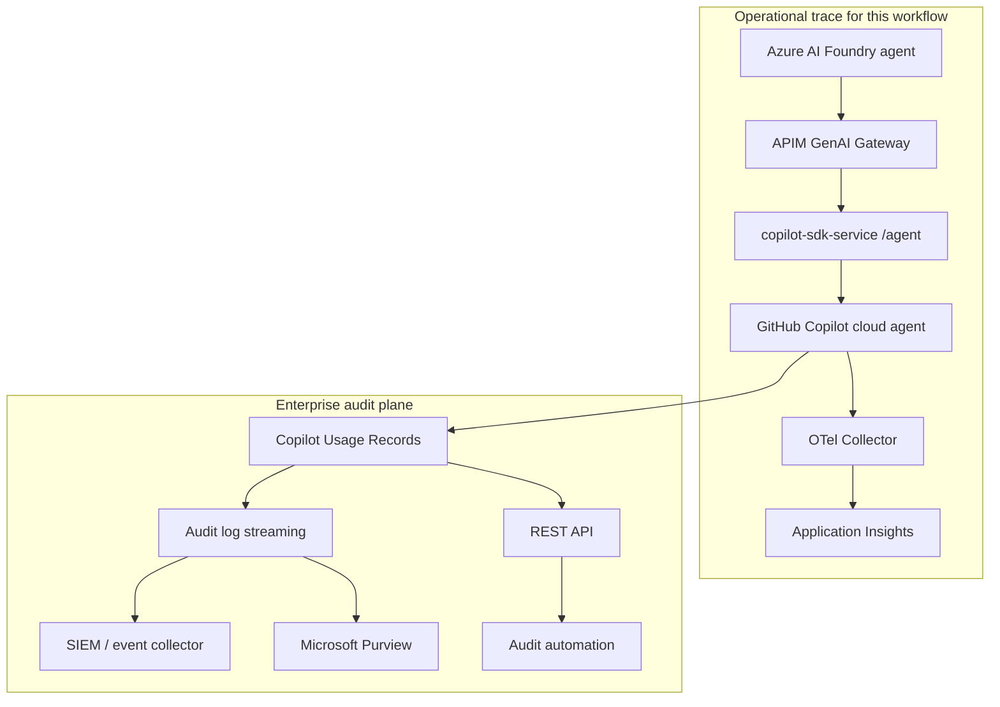
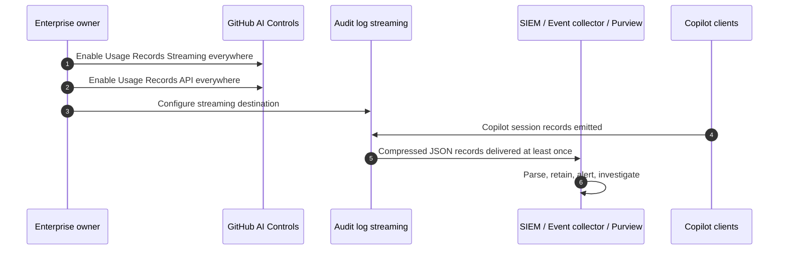

# GitHub Copilot Usage Records — Enterprise Audit Plane

This appendix adds a second observability/auditability layer to the Agentic SDLC Governance Demo.

The existing demo uses OpenTelemetry and Application Insights to prove one concrete workflow end-to-end: Foundry -> APIM -> `/agent` -> GitHub Copilot cloud agent -> PR. Copilot Usage Records complements that with enterprise-wide session evidence across Copilot clients.

---

## Why This Is Useful

For customer conversations, this is useful because it moves the story from "we can trace our demo" to "the enterprise can govern and audit AI-assisted engineering at scale".

| Need | This demo already has | Copilot Usage Records adds |
|---|---|---|
| Debug one agentic workflow | App Insights transaction and OTel spans | Not the primary tool |
| See model/tool execution tree | `github.copilot.coding_agent` spans under `copilot.cloud_agent.task` | Session-level prompts, responses and tool calls |
| Prove governance path | APIM diagnostics and token policies | Enterprise AI Controls and audit feed |
| Feed security/compliance systems | KQL/workbooks in Azure Monitor | Streaming to SIEM/event collector/Microsoft Purview |
| Investigate enterprise-wide Copilot usage | Limited to this repo/workflow | Usage records across clients and deployments |

Positioning: use OTel/App Insights for operational traceability and Copilot Usage Records for enterprise auditability.

---

## Feature Summary

GitHub Enterprise Cloud customers with Enterprise Managed Users can access Copilot agent session data across Copilot clients, including:

- Cloud agents operating on github.com and data-resident deployments on ghe.com.
- GitHub Copilot CLI.
- Visual Studio Code.
- Visual Studio.
- Partner IDEs, such as JetBrains and Eclipse.

The records can include activity such as prompts, responses and tool calls, depending on enterprise configuration and product behavior.

Two access paths are available:

| Path | Best for | Notes |
|---|---|---|
| Streaming endpoint | Continuous ingestion into audit/compliance tooling | Configure from enterprise audit log streaming settings |
| REST API | On-demand pull of recent usage records | Endpoint currently retrieves recent records, documented as last 48 hours |

This capability is public preview. Treat it as customer/enterprise-controlled, not as an app-level dependency.

---

## Where It Fits In The Architecture



The key message: App Insights gives the transaction view; Usage Records gives the enterprise session ledger.

---

## Enablement Checklist

Prerequisites:

- GitHub Enterprise Cloud.
- Enterprise Managed Users, or GitHub Enterprise Cloud with data residency where applicable.
- Enterprise owner permissions.
- A target destination for streaming, if using continuous export.

Enterprise settings:

1. Open the enterprise settings in GitHub.
2. Go to AI Controls.
3. Under Copilot, set `Copilot Usage Records Streaming` to `Enable everywhere`.
4. Under Copilot, set `Copilot Usage Records API` to `Enable everywhere`.
5. Configure an audit log streaming destination if using the streaming path.

Streaming destinations mentioned in the GitHub docs include Azure Blob Storage, Azure Event Hubs, Amazon S3, Datadog, Google Cloud Storage, Splunk, and Microsoft Purview for Copilot agent session events in public preview.

---

## REST API

Endpoint:

```http
GET /enterprises/{enterprise}/copilot/usage-records
```

Example with GitHub CLI:

```powershell
gh api "/enterprises/<enterprise>/copilot/usage-records"
```

Use this for:

- On-demand demos with enterprise owner access.
- Pulling the last available records into an investigation notebook or script.
- Joining recent Copilot session evidence with a known `operation_Id`, repo, actor or time window.

Do not use the REST API as the only long-term retention mechanism. For retention and compliance workflows, prefer streaming into the customer's approved data platform.

---

## Streaming Pattern



Operational notes:

- Delivery is documented as at-least-once, so downstream processing should handle duplicate events.
- Audit log streaming buffers paused streams for a limited period; operational teams still need monitoring and health checks.
- Privacy, data retention, redaction and access policies belong to the customer enterprise.

---

## How To Present It

Use this addition when talking to CISOs, platform owners, regulated customers or enterprise admins.

Talk track:

1. App Insights shows the live transaction: APIM, `/agent`, `copilot.cloud_agent.task`, model calls and tools.
2. GitHub Copilot Usage Records gives the enterprise a central record of Copilot session activity across clients.
3. Streaming sends those records into the customer's SIEM/event collector, or Microsoft Purview where applicable.
4. The REST API gives enterprise owners an on-demand way to retrieve recent records.
5. Together, the pattern supports both engineering observability and enterprise auditability.

Suggested demo split:

| Audience | Lead with | Then show |
|---|---|---|
| Engineering | App Insights transaction | How Usage Records closes audit/compliance gaps |
| Security/compliance | Usage Records / SIEM / Purview | How App Insights proves one workflow end-to-end |
| Executive | Governed Agentic SDLC | Evidence chain: APIM, PR, trace, enterprise records |

---

## Reuse Guidance

Add this option to customer engagements when one of these is true:

- The customer uses GitHub Enterprise Cloud with Enterprise Managed Users.
- Security wants prompts/responses/tool calls retained outside GitHub.
- The customer already streams GitHub audit logs into a SIEM.
- Microsoft Purview is part of the compliance architecture.
- The engagement needs a governance story beyond one repository or one demo workflow.

Do not make it a blocker for the base demo. The base IP works with App Insights + OTel; Usage Records is an enterprise audit extension.
