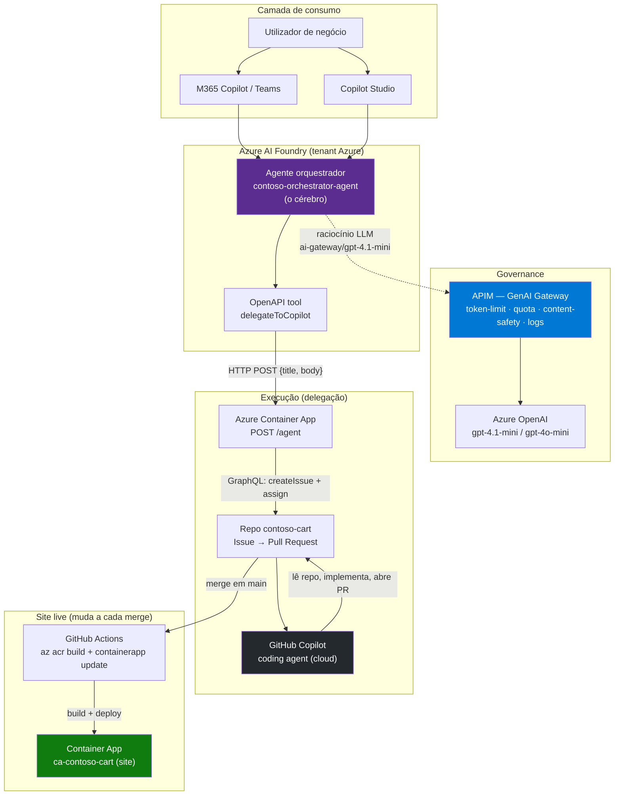
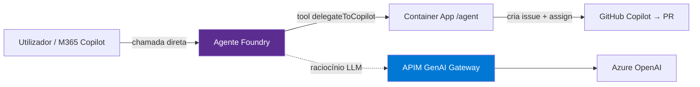
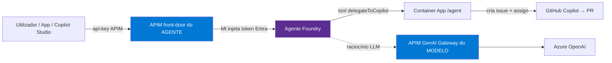

# Demo End-to-End — Agente Agêntico Governado (Foundry + APIM + GitHub Copilot)

> Demo: um **agente "cérebro"** no Azure AI Foundry recebe um pedido em linguagem natural,
> **raciocina através de um LLM governado pelo APIM**, e **delega a implementação a um
> coding agent do GitHub Copilot (cloud)** que lê o repositório e abre um Pull Request sozinho.
> A frase-chave para o cliente: **"APIM no meio"** — governance central de custo, segurança e
> observabilidade sobre todo o tráfego de modelos e agentes.

---

## 0. Links rápidos (live)

| Recurso | URL / ID |
|---|---|
| 🛒 **Site live** (contoso-cart) | `https://ca-contoso-cart.gentlepond-a81d8e3c.swedencentral.azurecontainerapps.io/` |
| 🛒 API do carrinho | `https://ca-contoso-cart.gentlepond-a81d8e3c.swedencentral.azurecontainerapps.io/api/cart` |
| 🤖 Container App `/agent` (delegação) | `https://ca-api-edudemo-csdk-4bq4xx.gentlepond-a81d8e3c.swedencentral.azurecontainerapps.io/agent` |
| 🐙 Repo GitHub | `https://github.com/eduxfernandes05/contoso-cart` |
| ⚙️ GitHub Actions (CI/CD) | `https://github.com/eduxfernandes05/contoso-cart/actions` |
| 🧠 APIM Gateway | `https://apim-zj44ehcf4zlxq.azure-api.net` |
| 🧠 OpenAI via APIM | `https://apim-zj44ehcf4zlxq.azure-api.net/inference/openai` |

---

## 1. A história (o "porquê")

Um colaborador de negócio descreve uma funcionalidade que quer ("adicionar um voucher de 10% no checkout").
Não escreve código, não sabe que ficheiros existem. O pedido entra num **agente orquestrador** que:

1. **Raciocina** sobre o pedido (via LLM) — e **cada chamada ao modelo passa pelo APIM**, que aplica
   limites de tokens, quotas, content safety e logging.
2. **Traduz** o pedido vago num **QUÊ** preciso (comportamento desejado + critérios de aceitação),
   **sem inventar caminhos de ficheiros nem nomes de funções**.
3. **Delega** esse QUÊ ao **GitHub Copilot coding agent** (cloud), que corre na infra do GitHub,
   **lê o repositório (o COMO)**, implementa, corre testes e **abre um Pull Request em draft**.
4. Um humano revê e faz merge.

O valor demonstrado: **autonomia agêntica real** + **governance empresarial** (o APIM) + **separação
clara QUÊ/COMO** (o negócio descreve a intenção; o coding agent decide a implementação).

---

## 2. Arquitetura completa (cenário final)

### Princípios de design

| Princípio | Concretização |
|---|---|
| **Cérebro governado** | O agente Foundry só fala com o LLM **através do APIM** (connection `ai-gateway`). |
| **Separação QUÊ / COMO** | O agente escreve **comportamento + critérios de aceitação**; o coding agent decide ficheiros/funções lendo o repo. |
| **Delegação assíncrona** | O `/agent` cria a issue e atribui ao Copilot; o coding agent trabalha **sozinho** e abre o PR. |
| **Human-in-the-loop final** | O PR fica em **draft** — um humano revê e faz merge. |

---

## 3. Componentes (estado real, com IDs)

### 3.1 Azure AI Foundry — o agente
| Item | Valor |
|---|---|
| Agente | `contoso-orchestrator-agent` (Version 2) |
| Projeto | `foundry-project-agents-foundry` |
| Conta (AIServices) | `agents-foundry-zj44ehcf4zlxq` |
| Entra Agent Identity | `f47aedc4-48e9-4284-bcee-4524741cfccd` |
| Modelo | **`ai-gateway/gpt-4.1-mini`** (via APIM) |
| Canal de publish | "Teams e Microsoft 365 Copilot" |

### 3.2 APIM — GenAI Gateway
| Item | Valor |
|---|---|
| Serviço | `apim-zj44ehcf4zlxq` (BasicV2) |
| Gateway | `https://apim-zj44ehcf4zlxq.azure-api.net` |
| Base OpenAI via APIM | `https://apim-zj44ehcf4zlxq.azure-api.net/inference/openai` |
| API | `inference-api` (path `inference`) |
| Header de chave | `api-key` |
| Policy de governance | `llm-token-limit` (TPM ajustável) |
| Subscriptions | `master`, `foundry-subscription`, `copilot-sdk-subscription` |

> **Connection Foundry→APIM**: `ai-gateway` (category `ApiManagement`, `authType ApiKey`),
> target = base OpenAI via APIM. É esta connection que faz o raciocínio do agente passar pelo APIM.

### 3.3 Modelos (backends do APIM)
Deployments locais Azure OpenAI na conta `models-foundry-zj44ehcf4zlxq` para onde o APIM encaminha:
`gpt-4o-mini`, `gpt-4.1-mini`, `gpt-5-mini`, `text-embedding-3-large`.

### 3.4 Azure Container App — o `/agent` (delegação)
| Item | Valor |
|---|---|
| Endpoint | `https://ca-api-edudemo-csdk-4bq4xx.gentlepond-a81d8e3c.swedencentral.azurecontainerapps.io/` |
| Rota | `POST /agent` body `{ title, body }` |
| Env | `GITHUB_TOKEN` (Key Vault secret `github-token`), `GITHUB_REPO=eduxfernandes05/contoso-cart` |
| Resource group | `rg-agent-demo` (azd env `edudemo-csdk`) |

**Lógica** (`copilot-sdk-service/src/api/routes/agent.ts`): GitHub GraphQL puro via `fetch` —
`repository.id` + `suggestedActors(CAN_BE_ASSIGNED)` → `createIssue` → `replaceActorsForAssignable`.
Resposta: `{ status:"delegated", issueNumber, issueUrl, assignedTo:"Copilot" }`.

### 3.5 OpenAPI tool do agente
`copilot-sdk-service/foundry/agent-tool.openapi.json` — `operationId delegateToCopilot`,
`POST /agent`, body `{ title (obrigatório), body }`. O `body` instrui explicitamente:
*"Do NOT specify file paths or function names — the coding agent inspects the repository and
decides the implementation details itself."* Auth no tool = **Anonymous**.

### 3.6 GitHub
| Item | Valor |
|---|---|
| Repo | `eduxfernandes05/contoso-cart` (privado, branch `main`) |
| Coding agent bot | `copilot-swe-agent` (bot ID `BOT_kgDOC9w8XQ`) |
| Atribuição | **só** via GraphQL `replaceActorsForAssignable` |

### 3.7 Tenants (importante — split)
| Plano | Tenant |
|---|---|
| Azure (Foundry/APIM/ACA) | `64986eab-445d-4496-9cc0-6059eb44089c` — sub `fc1573e2-1be9-4029-972c-053756991cf4` |
| Copilot Studio / Agent365 | `72f988bf-86f1-41af-91ab-2d7cd011db47` (corporativo) |

### 3.8 Site live + CI/CD (o repo **É** o site)
O `contoso-cart` deixou de ser um módulo e passou a ser uma **web app Express** servida numa Container App.
A cada **merge em `main`**, o GitHub Actions reconstrói a imagem e atualiza a Container App → **o site muda ao vivo**.

| Item | Valor |
|---|---|
| Site (Container App) | `ca-contoso-cart` em `cae-edudemo-csdk-4bq4xx` (`rg-agent-demo`) |
| URL do site | `https://ca-contoso-cart.gentlepond-a81d8e3c.swedencentral.azurecontainerapps.io/` |
| Ingress | externo, `targetPort 3000`, pull do ACR via **managed identity** |
| ACR | `acredudemocsd4bq4xx` (imagem `contoso-cart`) |
| App (web) | `server.js` (Express ESM) + `public/index.html` + `Dockerfile` |
| Workflow | `.github/workflows/deploy.yml` — `push:[main]` + `workflow_dispatch` |
| Auth do CI/CD | **OIDC** (sem secrets de password) |
| Service principal | app `gha-contoso-cart-deploy` (`appId a88c077d-4fc0-4836-a0b3-b087d3a83188`) |
| Federated credential | subject `repo:eduxfernandes05/contoso-cart:ref:refs/heads/main` |
| Roles do SP | `AcrPush` + `Contributor` (no ACR) + `Container Apps Contributor` (no RG) |
| GitHub secrets | `AZURE_CLIENT_ID`, `AZURE_TENANT_ID`, `AZURE_SUBSCRIPTION_ID` |

> **Validado**: workflow corrido manualmente → login OIDC ✅ → `az acr build` ✅ → `az containerapp update` ✅.
> O site responde **HTTP 200** e `/api/cart` devolve `{ subtotal: 16 }`.
> Como o repo agora é um site visível, quando o Copilot coding agent implementa uma feature de checkout, **também mexe na UI** — e o merge leva a mudança ao site.

---

## 4. Fluxo passo-a-passo (cenário completo)

1. **Utilizador** escreve em M365 Copilot / Teams / Copilot Studio: *"adiciona um voucher de 10% no checkout"*.
2. O pedido chega ao **agente Foundry** (orquestrador).
3. O agente **raciocina via LLM** — cada chamada passa pelo **APIM** (token-limit, quota, content-safety, logs).
4. O agente decide chamar o tool **`delegateToCopilot`** e produz `title` + `body` (QUÊ + critérios de aceitação, **sem** ficheiros).
5. O tool faz **HTTP POST** ao **Container App `/agent`**.
6. O `/agent` usa **GitHub GraphQL**: cria a **issue** e atribui ao **`copilot-swe-agent`**.
7. O **GitHub Copilot coding agent** lê o repo, implementa, corre testes e **abre um Pull Request (draft)**.
8. Um **humano** revê e faz merge em `main`.
9. O **GitHub Actions** dispara: `az acr build` → `az containerapp update` (auth **OIDC**).
10. A **Container App `ca-contoso-cart` muda ao vivo** — o cliente vê o site atualizado.

**Prova viva já obtida**: pedido "voucher 10%" → issue #7 → PR #8. Pedido "voucher 50%" →
issue #9 → PR #10. Governance: pedido excedeu o TPM do APIM → **`429 ModelGateway`** (a policy disparou).
CI/CD: workflow `Deploy to Azure Container App` corrido com sucesso (OIDC → build → deploy).

---

## 5. Onde estamos hoje (estado)

| Fase | Descrição | Estado |
|---|---|---|
| **F0** | APIM provisionado (GenAI Gateway) | ✅ Completo |
| **F1** | Foundry + projeto + conta | ✅ Completo |
| **F2** | Policies de governance (`llm-token-limit`) | ✅ Completo |
| **F3** | Container App `/agent` (delegação GitHub) | ✅ Completo + validado em produção (issue→PR) |
| **F4** | Agente Foundry + OpenAPI tool + **LLM via APIM** | ✅ Completo + validado live (429 governance) |
| **F5** | **Site live + CI/CD** (repo = Container App, muda a cada merge) | ✅ Completo + validado (OIDC→build→deploy) |
| **F6** | Copilot Studio / M365 Copilot publish | 🟡 Em curso (ver secção 7) |
| **F7** | Agent365 (mock) + Runbook da demo | ⬜ Pendente |

### Decisão de tuning da demo (TPM)
- **TPM baixo** (ex.: 200) → força o **`429`** para mostrar governance ao vivo (o "money-shot").
- **TPM alto** (ex.: 100000) → corridas end-to-end fluidas sem cortes.
- Recomendação: manter alto para os ensaios; baixar para 200 só no momento de mostrar o 429.

---

## 6. Os dois cenários de APIM

### Cenário A — APIM só entre o agente e o modelo (estado atual) ✅

APIM governa **os tokens do cérebro**. Quem chama o agente entra direto no Foundry.

### Cenário B — APIM nas duas pontas (front-door do agente também) 🎯

APIM governa **quem chama o agente** (auth, rate-limit, logs) **E** os tokens do modelo.
É **este cenário que também resolve o cross-tenant** do Copilot Studio (ver secção 7, Opção 2).

---

## 7. Integração com Copilot Studio — step-by-step

> **Bloqueio a decidir primeiro:** em que **M365 Copilot** vais demonstrar?
> - **Tenant Azure** (onde o Foundry vive) → publish direto, **sem** cross-tenant (Opção 1).
> - **Tenant corporativo** (onde tens a licença E5+Copilot) → precisas de **bridge** via APIM (Opção 2).

### Opção 1 — Publish direto (mesmo tenant, sem Copilot Studio)
O agente Foundry **já tem** o canal "Teams e Microsoft 365 Copilot".
1. No Foundry, abre o agente → **Channels / Publish**.
2. Seleciona **Teams + Microsoft 365 Copilot** → **Publish**.
3. Aprova o registo da app (Teams app / Entra) quando pedido.
4. O agente aparece no **M365 Copilot desse tenant** como agente declarativo.

> Mais simples, mas só serve se demonstrares no M365 Copilot **do tenant do Azure**.

### Opção 2 — Copilot Studio chama o agente via APIM (cross-tenant) 🎯
Esta é a forma robusta de aparecer no **Copilot Studio / M365 Copilot do tenant corporativo**.
A ponte é HTTPS + chave, por isso **atravessa o limite de tenant**.

**Passo 1 — Expor o agente atrás do APIM (Cenário B)**
- Cria uma API no APIM (`apim-zj44ehcf4zlxq`) com backend = endpoint de inferência do agente Foundry.
- Policy `authentication-managed-identity` (resource `https://ai.azure.com`) → o APIM obtém o token Entra sozinho.
- Dá à **Managed Identity do APIM** o role **Cognitive Services User** na conta `agents-foundry-zj44ehcf4zlxq`.
- Cria uma **subscription** no APIM → obténs uma `api-key` para o Copilot Studio usar.

**Passo 2 — Custom connector no Copilot Studio (tenant corporativo)**
1. Vai a `https://copilotstudio.microsoft.com` (tenant corporativo).
2. **Create → New agent** (ou abre um existente).
3. **Settings → Actions / Tools → Add an action → New custom connector**.
4. Importa o **OpenAPI** do endpoint do APIM (ou define host `apim-zj44ehcf4zlxq.azure-api.net`,
   path da API, operação POST).
5. Em **Security**, define **API Key** → nome do header `api-key`, valor = a subscription key do Passo 1.

**Passo 3 — Ligar a action a um topic**
1. No agente, cria um **Topic** (ou usa o fallback "Conversational").
2. Adiciona um nó **Call an action** → escolhe a operação do connector.
3. Passa a **mensagem do utilizador** como input (`title`/`body` ou o prompt do agente).
4. Devolve a resposta (ex.: `issueUrl`) numa **Message** ao utilizador.

**Passo 4 — Testar e publicar**
1. Usa o **Test pane** do Copilot Studio para validar a chamada end-to-end.
2. **Publish** → adiciona o canal **Teams + Microsoft 365 Copilot** (corporativo).
3. O agente fica disponível no **M365 Copilot do tenant corporativo**, e por baixo:
   Copilot Studio → APIM → Agente Foundry → (LLM via APIM) → tool → GitHub Copilot → PR.

> **Nota de arquitetura:** na Opção 2, o Copilot Studio chama o **agente Foundry** (mantém o cérebro
> e a governance), **não** salta diretamente para o `/agent`. Assim a separação QUÊ/COMO e o
> "APIM no meio" mantêm-se intactos.

---

## 8. Possíveis incrementos (roadmap)

### Governance / APIM
- **`llm-token-quota`** — orçamento de tokens por período (budget mensal por equipa/consumidor).
- **`llm-emit-token-metric`** — emitir tokens por consumidor/modelo para App Insights → **chargeback/showback**.
- **`llm-semantic-cache`** — cache de prompts semelhantes → menos custo e latência.
- **Load balancing + circuit breaker** — pool de vários deployments/regiões com failover automático.
- **`llm-content-safety`** — moderação do prompt (Azure AI Content Safety) antes do modelo.
- **Managed identity para o backend** — eliminar chaves nos clientes.
- **Cenário B** — APIM à frente do próprio agente (auth/rate-limit/logs sobre a invocação do agente).

### Segurança
- **Proteger o `/agent`** — hoje é público/anónimo; adicionar API key, ou pô-lo **só** acessível via APIM/rede privada.
- **Substituir o PAT** (`GITHUB_TOKEN`) por **GitHub App** com permissões mínimas.
- **Networking privado** (VNet) entre ACA, APIM e Foundry.

### Capacidades do agente
- **Múltiplos tools** — além do GitHub, delegar a Jira / Azure DevOps / ServiceNow.
- **Human-in-the-loop antes de delegar** — aprovação explícita antes de criar a issue.
- **Multi-step planning** — o agente abre várias issues coordenadas para tarefas grandes.

### Observabilidade e operação
- **Dashboards App Insights** — tokens, latência, taxa de 429, custo por consumidor.
- **Agent365 (F6)** — governance e identidade de agentes à escala empresarial.
- **Runbook (F7)** — guião de demo passo-a-passo, com os comandos e os pontos de "money-shot".

---

## 9. Glossário rápido para o cliente

| Termo | Em uma frase |
|---|---|
| **APIM / GenAI Gateway** | Porta de entrada única e governada para todo o tráfego de modelos e agentes. |
| **Agente Foundry (cérebro)** | Raciocina sobre o pedido e decide **o quê** delegar — sem aceder ao repo. |
| **GitHub Copilot coding agent** | Lê o repo e decide **como** implementar; abre um PR sozinho. |
| **QUÊ vs COMO** | Negócio descreve a intenção (QUÊ); o coding agent escolhe a implementação (COMO). |
| **429 ModelGateway** | Prova viva da governance: a policy de tokens do APIM disparou. |
