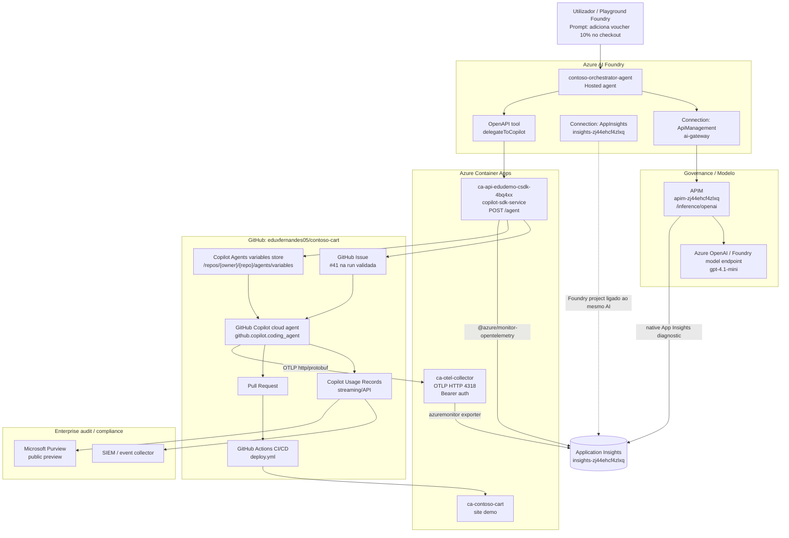
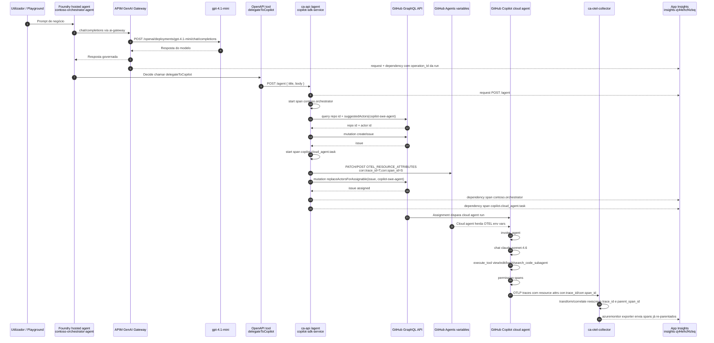
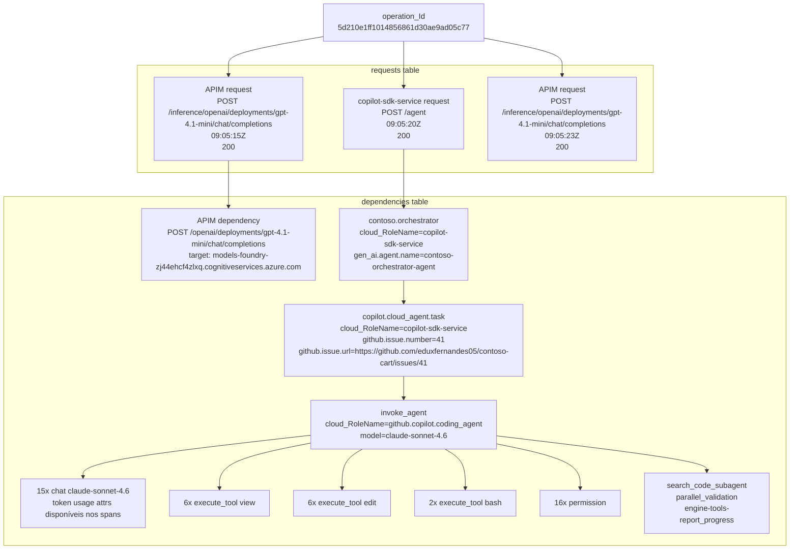
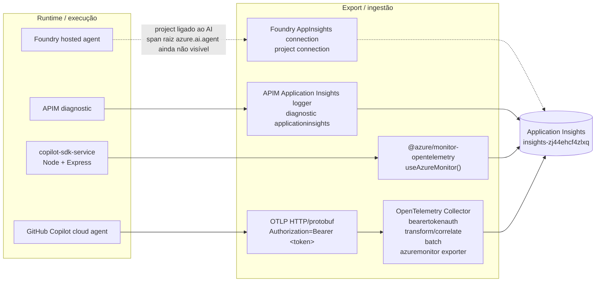
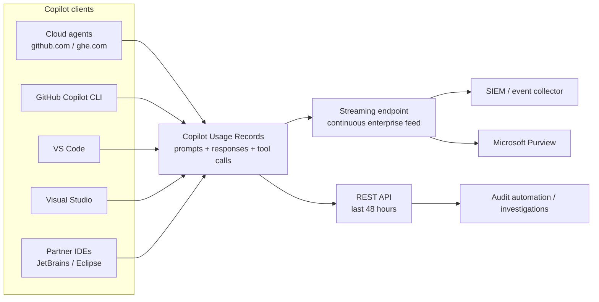
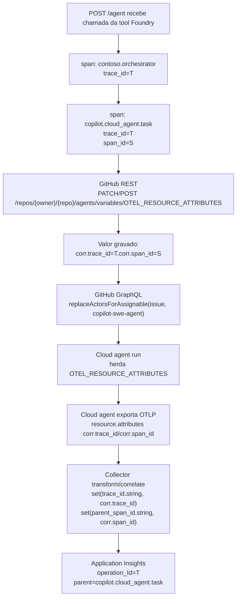
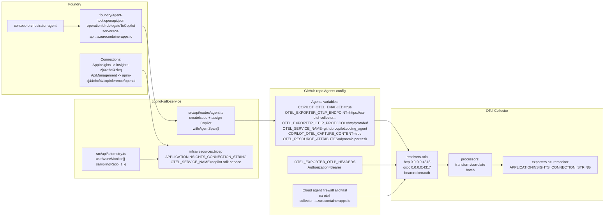
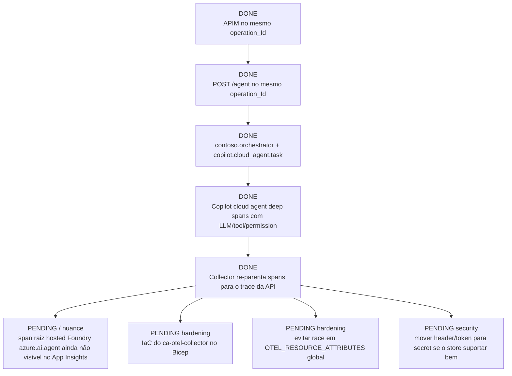

# Diagrama Completo — Observabilidade End-to-End Foundry + APIM + Copilot Cloud Agent

> Estado validado em 2026-07-06.  
> Trace real validado no Application Insights: `operation_Id=5d210e1ff1014856861d30ae9ad05c77`.

Este documento explica como a demo faz tracing end-to-end desde o agente hosted no Azure AI Foundry, passando pelo APIM GenAI Gateway, pela tool OpenAPI `/agent`, pelo serviço `copilot-sdk-service`, pelo GitHub Copilot cloud agent e finalmente pelo Application Insights.

O ponto mais importante: hoje a correlação principal funciona. O mesmo `operation_Id` contém APIM, `POST /agent`, os spans `contoso.orchestrator` / `copilot.cloud_agent.task` e a árvore profunda do GitHub Copilot cloud agent (`invoke_agent`, `chat claude-sonnet-4.6`, `execute_tool`, `permission`, etc.).

Camada complementar: para clientes GitHub Enterprise Cloud com Enterprise Managed Users, Copilot Usage Records pode fornecer visibilidade de prompts, respostas e tool calls em todos os clientes Copilot. Isto complementa o OTel/App Insights com auditabilidade enterprise-wide. Ver [COPILOT-USAGE-RECORDS.md](COPILOT-USAGE-RECORDS.md).

Ainda há uma nuance: não aparece um span raiz explícito do runtime hosted Foundry como `azure.ai.agent` nas tabelas consultadas do App Insights. O trace entra no App Insights já com APIM e a tool call correlacionados.

---

## 1. Visão Macro



---

## 2. Sequência Runtime Completa



---

## 3. Árvore Real da Transação Validada

Trace validado depois do prompt: `Adiciona um voucher de 10% no checkout do contoso-cart.`

`operation_Id = 5d210e1ff1014856861d30ae9ad05c77`



Resumo por role/name nessa operação:

| Tabela | cloud_RoleName | Nome | Contagem |
|---|---|---:|---:|
| requests | `apim-zj44ehcf4zlxq Sweden Central` | `POST /inference/openai/deployments/gpt-4.1-mini/chat/completions` | 2 |
| requests | `copilot-sdk-service` | `POST /agent` | 1 |
| dependencies | `apim-zj44ehcf4zlxq Sweden Central` | `POST /openai/deployments/gpt-4.1-mini/chat/completions` | 2 |
| dependencies | `copilot-sdk-service` | `contoso.orchestrator` | 1 |
| dependencies | `copilot-sdk-service` | `copilot.cloud_agent.task` | 1 |
| dependencies | `github.copilot.coding_agent` | `invoke_agent` | 1 |
| dependencies | `github.copilot.coding_agent` | `chat claude-sonnet-4.6` | 15 |
| dependencies | `github.copilot.coding_agent` | `execute_tool view` | 6 |
| dependencies | `github.copilot.coding_agent` | `execute_tool edit` | 6 |
| dependencies | `github.copilot.coding_agent` | `execute_tool bash` | 2 |
| dependencies | `github.copilot.coding_agent` | `permission` | 16 |

---

## 4. Data Plane de Telemetria

Há três caminhos de telemetria diferentes a aterrar no mesmo Application Insights.



Detalhe dos caminhos:

| Fonte | Como exporta | Onde configura | Resultado |
|---|---|---|---|
| Foundry hosted agent | Connection do projeto para App Insights | Foundry project connection `agents-foundry-zj44ehcf4zlxq-appInsights-connection` | Projeto está ligado, mas span explícito `azure.ai.agent` ainda não apareceu nas queries |
| APIM | Diagnostic Application Insights | APIM `apim-zj44ehcf4zlxq` | Requests/dependencies APIM no mesmo `operation_Id` |
| `copilot-sdk-service` | Azure Monitor OpenTelemetry distro | `src/api/telemetry.ts` + env `APPLICATIONINSIGHTS_CONNECTION_STRING` | `POST /agent`, `contoso.orchestrator`, `copilot.cloud_agent.task` |
| Copilot cloud agent | OTLP HTTP/protobuf | GitHub Agents variables + firewall allowlist | Árvore profunda `github.copilot.coding_agent` |
| OTel Collector | Azure Monitor exporter | `observability/otel-collector/config.yaml` | Re-parent dos spans do cloud agent para a transação da API |
| Copilot Usage Records | Audit log streaming ou REST API enterprise | GitHub Enterprise AI Controls + audit log streaming destination | Prompts, responses e tool calls enterprise-wide para SIEM/Purview/auditoria |

### 4.1 Como Usage Records encaixa



Usage Records responde a uma pergunta diferente do OTel:

| Pergunta | Melhor fonte |
|---|---|
| Esta execução específica passou por APIM, `/agent`, `copilot.cloud_agent.task` e tool calls? | App Insights + OTel |
| Que sessões Copilot aconteceram no enterprise, em que cliente, com que prompts/respostas/tool calls? | Copilot Usage Records |
| Como mando isto para SIEM/Purview sem instrumentar cada app? | Audit log streaming + Copilot Usage Records |

---

## 5. Como o `copilot.cloud_agent.task` Vira Pai do Cloud Agent

O GitHub Copilot cloud agent não aceitou `TRACEPARENT` como mecanismo de parenting. A solução usada é: passar correlação como resource attributes e reescrever o trace no Collector.



Código responsável no `/agent`:

```ts
const { traceId, spanId } = taskSpan.spanContext();
await upsertAgentsVariable(
  token,
  owner,
  name,
  "OTEL_RESOURCE_ATTRIBUTES",
  `corr.trace_id=${traceId},corr.span_id=${spanId}`,
);
```

Transform no Collector:

```yaml
processors:
  transform/correlate:
    error_mode: ignore
    trace_statements:
      - context: span
        statements:
          - set(trace_id.string, resource.attributes["corr.trace_id"]) where resource.attributes["corr.trace_id"] != nil
          - set(parent_span_id.string, resource.attributes["corr.span_id"]) where resource.attributes["corr.span_id"] != nil and parent_span_id.string == ""
```

Importante: `OTEL_RESOURCE_ATTRIBUTES` é uma variável global do store de Agents do repo. Para demo sequencial está OK. Para concorrência real, há risco de race condition se duas delegações forem disparadas quase ao mesmo tempo.

---

## 6. Configuração por Componente



---

## 7. O Que Cada Span Representa

| Span / request | Origem | Tabela App Insights | Significado |
|---|---|---|---|
| `POST /inference/openai/deployments/gpt-4.1-mini/chat/completions` | APIM | `requests` | Foundry chamou o modelo via APIM |
| `POST /openai/deployments/gpt-4.1-mini/chat/completions` | APIM | `dependencies` | APIM encaminhou para o endpoint Cognitiveservices/Foundry model |
| `POST /agent` | Container App API | `requests` | Tool OpenAPI `delegateToCopilot` chamou a API |
| `contoso.orchestrator` | `copilot-sdk-service` | `dependencies` | Span lógico da orquestração governada |
| `copilot.cloud_agent.task` | `copilot-sdk-service` | `dependencies` | Momento em que a task é delegada ao GitHub Copilot cloud agent |
| `invoke_agent` | Copilot cloud agent | `dependencies` | Execução principal do cloud agent |
| `chat claude-sonnet-4.6` | Copilot cloud agent | `dependencies` | Chamadas LLM internas do agent, com atributos de tokens |
| `execute_tool view/edit/bash` | Copilot cloud agent | `dependencies` | Ferramentas usadas pelo agent no repo |
| `permission` | Copilot cloud agent | `dependencies` | Gates/autorização das tool calls |

---

## 8. Como Abrir a Transação no Portal

1. Azure Portal → Application Insights `insights-zj44ehcf4zlxq`.
2. Abrir `Transaction search`.
3. Pesquisar por:

```text
5d210e1ff1014856861d30ae9ad05c77
```

4. Abrir um item da transação e escolher `End-to-end transaction details`.
5. Confirmar roles:
   - `apim-zj44ehcf4zlxq Sweden Central`
   - `copilot-sdk-service`
   - `github.copilot.coding_agent`

---

## 9. Queries KQL Úteis

### 9.1 Ver requests do trace validado

```kusto
requests
| where operation_Id == "5d210e1ff1014856861d30ae9ad05c77"
| project timestamp, cloud_RoleName, name, url, operation_ParentId, id, success, resultCode
| order by timestamp asc
```

### 9.2 Ver dependencies do trace validado

```kusto
dependencies
| where operation_Id == "5d210e1ff1014856861d30ae9ad05c77"
| project timestamp, cloud_RoleName, name, target, type, operation_ParentId, id, success, resultCode,
          genai=tostring(customDimensions["gen_ai.system"]),
          agent=tostring(customDimensions["gen_ai.agent.name"]),
          model=tostring(customDimensions["gen_ai.request.model"])
| order by timestamp asc
```

### 9.3 Resumo por role/name

```kusto
dependencies
| where operation_Id == "5d210e1ff1014856861d30ae9ad05c77"
| summarize count(), min(timestamp), max(timestamp) by cloud_RoleName, name
| order by min_timestamp asc
```

### 9.4 Procurar spans Foundry explícitos

```kusto
dependencies
| where timestamp > ago(6h)
| where cloud_RoleName has "foundry"
   or name has "foundry"
   or name has "delegate"
   or tostring(customDimensions) has "azure.ai.agent"
   or tostring(customDimensions) has "contoso-orchestrator-agent"
| project timestamp, cloud_RoleName, name, operation_Id, operation_ParentId, id, customDimensions
| order by timestamp desc
```

---

## 10. Estado Atual vs Falta



---

## 11. Interpretação Correta Para Demo

Frase curta e tecnicamente honesta:

> A demo já tem trace end-to-end correlacionado em Application Insights: Foundry usa APIM para o modelo, chama a tool `/agent`, o serviço cria `contoso.orchestrator` e `copilot.cloud_agent.task`, e o GitHub Copilot cloud agent exporta a árvore profunda via OTLP para um Collector que re-parenta os spans para o mesmo `operation_Id`. O que ainda não aparece é um span raiz explícito do runtime hosted Foundry com `gen_ai.system=azure.ai.agent`; APIM e tool calls já aparecem correlacionados.

---

## 12. Limitações Técnicas Conhecidas

| Limitação | Impacto | Mitigação atual |
|---|---|---|
| Cloud agent ignora `TRACEPARENT` como env var | Não dá para parentar diretamente por trace context nativo | Usamos `OTEL_RESOURCE_ATTRIBUTES` + Collector transform |
| `OTEL_RESOURCE_ATTRIBUTES` é global no repo | Corridas concorrentes podem trocar `corr.trace_id` | OK para demo sequencial; para produção precisaria de isolamento por task/run ou outro canal de correlação |
| Hosted Foundry não mostra `azure.ai.agent` nas queries atuais | A raiz visual pode começar em APIM/tool, não no agent hosted | Foundry project está conectado ao AI; continuar a validar portal Foundry Traces vs App Insights |
| Collector exposto publicamente | Superfície de ingestão pública | Bearer token + firewall allowlist do cloud agent |
| Collector ainda não está em Bicep | Pode perder-se em reprovisionamento | Fase futura: IaC do `ca-otel-collector` |

---

## 13. Nomes Reais Para Referência

| Item | Valor |
|---|---|
| Resource group | `rg-agent-demo` |
| App Insights principal | `insights-zj44ehcf4zlxq` |
| Foundry account | `agents-foundry-zj44ehcf4zlxq` |
| Foundry project | `foundry-project-agents-foundry` |
| Foundry agent | `contoso-orchestrator-agent` |
| APIM | `apim-zj44ehcf4zlxq` |
| API Container App | `ca-api-edudemo-csdk-4bq4xx` |
| Collector Container App | `ca-otel-collector` |
| Collector endpoint | `https://ca-otel-collector.gentlepond-a81d8e3c.swedencentral.azurecontainerapps.io` |
| GitHub repo | `eduxfernandes05/contoso-cart` |
| Copilot cloud agent role | `github.copilot.coding_agent` |
| Validated issue | `https://github.com/eduxfernandes05/contoso-cart/issues/41` |
| Validated operation_Id | `5d210e1ff1014856861d30ae9ad05c77` |
