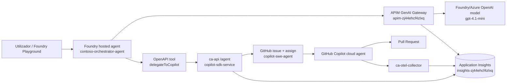

# Estado Atual — Demo Ready to Present

Data: 2026-07-06

Esta e a fonte curta de estado. Para o desenho completo de tracing, ver [DIAGRAMA-OBSERVABILIDADE-E2E.md](DIAGRAMA-OBSERVABILIDADE-E2E.md). Para o guiao de gravacao, ver [APRESENTACAO-LINKEDIN.md](APRESENTACAO-LINKEDIN.md).

Para reutilizar como IP noutra equipa/repo/cliente, ver [REUSE-GUIDE.md](REUSE-GUIDE.md).

---

## Resultado Validado

A demo esta pronta para apresentacao.

Trace validado no Application Insights:

```text
operation_Id=5d210e1ff1014856861d30ae9ad05c77
```

Prompt validado:

```text
Adiciona um voucher de 10% no checkout do contoso-cart.
```

Issue criada:

```text
https://github.com/eduxfernandes05/contoso-cart/issues/41
```

O trace contem:

- APIM `apim-zj44ehcf4zlxq Sweden Central`
- `POST /agent` no `copilot-sdk-service`
- `contoso.orchestrator`
- `copilot.cloud_agent.task`
- `github.copilot.coding_agent`
- `invoke_agent`
- `chat claude-sonnet-4.6`
- `execute_tool view/edit/bash`
- `permission`

---

## Arquitetura Atual



---

## Recursos Reais

| Recurso | Valor |
|---|---|
| Subscription | `fc1573e2-1be9-4029-972c-053756991cf4` |
| Resource group | `rg-agent-demo` |
| App Insights principal | `insights-zj44ehcf4zlxq` |
| Foundry account | `agents-foundry-zj44ehcf4zlxq` |
| Foundry project | `foundry-project-agents-foundry` |
| Foundry agent | `contoso-orchestrator-agent` |
| APIM | `apim-zj44ehcf4zlxq` |
| API Container App | `ca-api-edudemo-csdk-4bq4xx` |
| OTel Collector | `ca-otel-collector` |
| Collector endpoint | `https://ca-otel-collector.gentlepond-a81d8e3c.swedencentral.azurecontainerapps.io` |
| GitHub repo | `eduxfernandes05/contoso-cart` |
| Site live | `https://ca-contoso-cart.gentlepond-a81d8e3c.swedencentral.azurecontainerapps.io/` |

---

## O Que Esta Feito

| Area | Estado |
|---|---|
| Foundry hosted agent | Feito |
| Foundry -> APIM para modelo | Feito |
| APIM telemetry no App Insights | Feito |
| OpenAPI tool `delegateToCopilot` | Feito |
| `/agent` cria issue + atribui Copilot | Feito |
| `copilot-sdk-service` com OpenTelemetry | Feito |
| Span `contoso.orchestrator` | Feito |
| Span `copilot.cloud_agent.task` | Feito |
| OTel Collector para cloud agent | Feito |
| Copilot cloud agent deep spans | Feito |
| Re-parenting do cloud agent para mesmo trace | Feito |
| APIM + `/agent` + cloud agent no mesmo `operation_Id` | Feito |
| Runbook LinkedIn | Feito |

---

## Nuance Ainda Aberta

O hosted Foundry runtime esta ligado ao mesmo App Insights, mas nas queries atuais nao apareceu como span raiz explicito `azure.ai.agent`. A parte operacional demonstravel esta correlacionada: APIM -> tool `/agent` -> `copilot.cloud_agent.task` -> deep tree do GitHub Copilot cloud agent.

---

## Hardening Pos-demo

| Item | Por que importa |
|---|---|
| IaC do `ca-otel-collector` | Evitar drift/manual setup |
| Secret real para `OTEL_EXPORTER_OTLP_HEADERS` | Evitar token em variable de demo |
| Isolamento de correlacao por task | Evitar race se duas delegacoes correrem em paralelo |
| `/agent` atras de APIM/auth | Fechar endpoint publico/anonymo |
| GitHub App em vez de PAT | Permissoes minimas e operacao mais limpa |

---

## Pronto Para Reutilizacao

O pacote documental agora tem tres camadas:

| Camada | Documento | Uso |
|---|---|---|
| Landing page | [README.md](README.md) | Explicar a demo e a arquitetura a qualquer pessoa |
| Reuse playbook | [REUSE-GUIDE.md](REUSE-GUIDE.md) | Adaptar a outro repo ou customer engagement |
| Deep technical appendix | [DIAGRAMA-OBSERVABILIDADE-E2E.md](DIAGRAMA-OBSERVABILIDADE-E2E.md) | Tracing, collector, KQL e span tree |
| Enterprise audit appendix | [COPILOT-USAGE-RECORDS.md](COPILOT-USAGE-RECORDS.md) | Copilot Usage Records, SIEM/Purview e auditabilidade enterprise |
