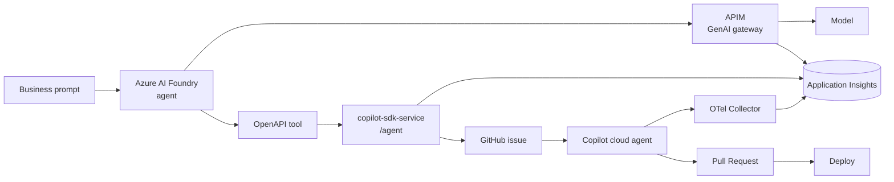

# Agentic SDLC on Azure

**A natural-language request becomes a reviewed pull request and a live deployment — governed, and fully observable end to end.**

A hosted Azure AI Foundry agent reasons through an APIM-governed model, delegates the implementation to the GitHub Copilot cloud agent, and the change ships to Azure Container Apps. Every step lands in a single Application Insights trace.

---



---

## What This Demo Shows

- **Governed model access** — the agent reaches the model only through Azure API Management.
- **Intent vs implementation** — Foundry decides *what* to build; GitHub Copilot decides *how*.
- **Human in the loop** — work lands as an issue and a pull request before merge.
- **End-to-end observability** — one `operation_Id` contains APIM, the delivery API, and the deep cloud-agent execution tree (LLM calls, tool calls, permissions).
- **Live proof** — merging deploys the `contoso-cart` site to Azure Container Apps.

---

## Quickstart (local app)

```bash
npm install
npm test
npm start
```

The site runs on `http://localhost:3000`.

---

## Deploy

The full stack (delivery API, OpenTelemetry Collector, Foundry tool, APIM and the site) is described in [docs/deployment.md](docs/deployment.md).

The `contoso-cart` site deploys to Azure Container Apps on every push to `main` via [.github/workflows/deploy.yml](.github/workflows/deploy.yml) using OIDC.

---

## Observability Proof

After a delegation, open Application Insights and search `Transaction search` for your run's `operation_Id`.

The transaction spans APIM, `POST /agent`, `contoso.orchestrator`, `copilot.cloud_agent.task`, and the GitHub Copilot cloud-agent tree (`invoke_agent`, `chat`, `execute_tool`, `permission`). Details and KQL in [docs/observability.md](docs/observability.md).

---

## Repository Structure

```text
.
├── server.js, src/, public/, test/    # contoso-cart demo app
├── .github/workflows/deploy.yml        # CI/CD to Azure Container Apps
├── copilot-sdk-service/                # delivery API (/agent), Bicep infra, Foundry OpenAPI tool
├── observability/otel-collector/       # OpenTelemetry Collector config
└── docs/                               # architecture, deployment, observability
```

---

## Documentation

| Document | Contents |
|---|---|
| [docs/architecture.md](docs/architecture.md) | System design, runtime sequence, trace correlation, span reference |
| [docs/deployment.md](docs/deployment.md) | Azure + GitHub resources and how to deploy and configure each part |
| [docs/observability.md](docs/observability.md) | Validated trace, telemetry paths, KQL queries |
| [docs/copilot-usage-records.md](docs/copilot-usage-records.md) | Optional enterprise audit layer via GitHub Copilot Usage Records |

---

## Stack

Azure AI Foundry · Azure API Management · Azure Container Apps · GitHub Copilot cloud agent · OpenTelemetry · Application Insights
