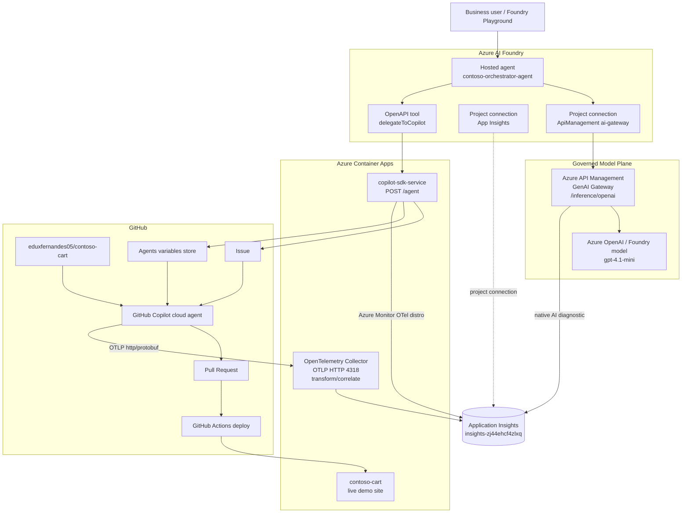
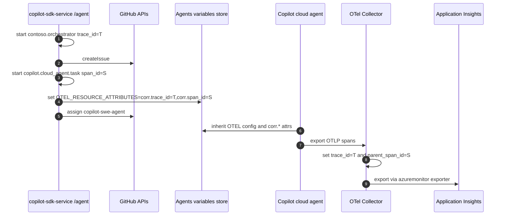

# Agentic SDLC Governance Demo

Reusable showcase for an end-to-end agentic software-delivery loop with Azure AI Foundry, Azure API Management, Azure Container Apps, GitHub Copilot cloud agent, OpenTelemetry and Application Insights.

This repo is packaged as demo IP: it is meant to be understandable by someone who did not build it, reusable by other MALT teams, and concrete enough to turn into a customer engagement, workshop or internal accelerator.

The repository now contains both layers of the demo: the visible `contoso-cart` target app and the reusable agentic SDLC platform assets used to orchestrate, delegate and observe coding-agent work.

Status: ready to present and ready to adapt.  
Last validated end-to-end run: 2026-07-06.  
Validated trace: `operation_Id=5d210e1ff1014856861d30ae9ad05c77`.

---

## Executive Story

A business user asks for a product change in natural language. A hosted Azure AI Foundry agent reasons about the request through an APIM-governed model connection, then calls an OpenAPI tool that delegates the implementation to the GitHub Copilot cloud agent. The coding agent reads the target repo, edits code, opens a pull request, and the CI/CD pipeline deploys the updated site.

The value is not just automation. The value is an operated agentic workflow:

- Governance: APIM sits in the model path for policy, quota, logging and token controls.
- Delegation: Foundry owns the business intent; GitHub Copilot owns repo-level implementation.
- Human-in-the-loop: work lands as issues and pull requests before merge.
- Observability: App Insights shows APIM, the delegation API, `copilot.cloud_agent.task`, and the deep Copilot cloud-agent execution tree in one trace.

---

## What This Demonstrates

| Capability | Concrete implementation |
|---|---|
| Agent orchestration | Azure AI Foundry hosted agent `contoso-orchestrator-agent` |
| Governed model access | Foundry model connection points to APIM `ai-gateway` instead of calling the model directly |
| GenAI gateway pattern | APIM `apim-zj44ehcf4zlxq` fronts `/inference/openai` and forwards to `gpt-4.1-mini` |
| Tool calling | OpenAPI tool `delegateToCopilot` calls `POST /agent` on `copilot-sdk-service` |
| Coding-agent delegation | `/agent` creates a GitHub issue and assigns `copilot-swe-agent` |
| Cloud agent OTEL | GitHub Copilot cloud agent exports OTLP traces to an OpenTelemetry Collector |
| Trace stitching | Collector rewrites cloud-agent trace ids using `corr.trace_id` and `corr.span_id` |
| App Insights E2E view | One `operation_Id` contains APIM, API spans and cloud-agent deep spans |
| Live app proof | `contoso-cart` deploys to Azure Container Apps after merge |

---

## Money Shot

Open Application Insights `insights-zj44ehcf4zlxq` and search in `Transaction search` for:

```text
5d210e1ff1014856861d30ae9ad05c77
```

The transaction includes:

- `apim-zj44ehcf4zlxq Sweden Central`
- `copilot-sdk-service`
- `github.copilot.coding_agent`
- `contoso.orchestrator`
- `copilot.cloud_agent.task`
- `invoke_agent`
- `chat claude-sonnet-4.6`
- `execute_tool view/edit/bash`
- `permission`

Validated prompt:

```text
Adiciona um voucher de 10% no checkout do contoso-cart.
```

Validated issue:

```text
https://github.com/eduxfernandes05/contoso-cart/issues/41
```

---

## Architecture



For the full sequence diagrams, KQL, span tree and collector details, see [DIAGRAMA-OBSERVABILIDADE-E2E.md](DIAGRAMA-OBSERVABILIDADE-E2E.md).

---

## Runtime Flow

1. User sends a natural-language request to the Foundry agent.
2. Foundry calls the model via the APIM `ai-gateway` connection.
3. APIM applies the GenAI gateway controls and logs requests/dependencies to App Insights.
4. Foundry decides to call the OpenAPI tool `delegateToCopilot`.
5. The tool sends `POST /agent` to the `copilot-sdk-service` Container App.
6. The API emits `contoso.orchestrator`, creates a GitHub issue, then emits `copilot.cloud_agent.task`.
7. The API writes `OTEL_RESOURCE_ATTRIBUTES=corr.trace_id=<T>,corr.span_id=<S>` into the GitHub Agents variables store.
8. The API assigns `copilot-swe-agent` to the issue.
9. GitHub Copilot cloud agent starts, inherits OTEL config, reads the repo and emits deep OTLP spans.
10. The OTel Collector rewrites trace id/parent id and exports to App Insights.
11. The PR is reviewed/merged and GitHub Actions deploys `contoso-cart` to Azure Container Apps.

---

## Observability Contract

The key technical trick is trace stitching between the API-owned trace and the GitHub-hosted cloud agent.



Telemetry paths:

| Source | Transport | Destination | Notes |
|---|---|---|---|
| APIM | Native App Insights diagnostic | `insights-zj44ehcf4zlxq` | Captures model gateway requests/dependencies |
| `copilot-sdk-service` | `@azure/monitor-opentelemetry` | `insights-zj44ehcf4zlxq` | Emits API request and logical GenAI spans |
| Copilot cloud agent | OTLP HTTP/protobuf | `ca-otel-collector` | Emits `invoke_agent`, `chat`, `execute_tool`, `permission` |
| OTel Collector | Azure Monitor exporter | `insights-zj44ehcf4zlxq` | Applies `transform/correlate` before export |

Nuance: the Foundry hosted runtime is connected to the same App Insights resource, but the validated App Insights queries did not show a distinct hosted Foundry root span named `azure.ai.agent`. The operational chain APIM -> tool -> API -> cloud agent is correlated and demonstrable.

---

## Repo Map

| Path | Purpose | Reuse notes |
|---|---|---|
| [copilot-sdk-service/](copilot-sdk-service/) | API, Bicep infra, `/agent`, OpenTelemetry, OpenAPI tool | Main reusable service surface |
| [copilot-sdk-service/src/api/routes/agent.ts](copilot-sdk-service/src/api/routes/agent.ts) | Creates issue, assigns Copilot, writes correlation attrs | Replace repo targeting, auth and issue policy here |
| [copilot-sdk-service/src/api/telemetry.ts](copilot-sdk-service/src/api/telemetry.ts) | Azure Monitor OTel bootstrap and GenAI span helper | Keep imported first in API startup |
| [copilot-sdk-service/foundry/agent-tool.openapi.json](copilot-sdk-service/foundry/agent-tool.openapi.json) | OpenAPI tool registered in Foundry | Update server URL and schema per engagement |
| [observability/otel-collector/config.yaml](observability/otel-collector/config.yaml) | OTLP receiver, auth, trace re-parenting and App Insights export | Productionize auth/secret handling before broader reuse |
| [server.js](server.js), [src/](src/), [public/](public/) | Target `contoso-cart` app used for the demo | Swap for a customer/product repo in new engagements |
| [.github/workflows/deploy.yml](.github/workflows/deploy.yml) | CI/CD path for the live Container App | Replace with the customer's deployment workflow |
| [test/](test/) | App validation suite | Keeps the demo app safe while the repo also hosts IP assets |
| [DIAGRAMA-OBSERVABILIDADE-E2E.md](DIAGRAMA-OBSERVABILIDADE-E2E.md) | Deep architecture and tracing documentation | Use as technical appendix |
| [APRESENTACAO-LINKEDIN.md](APRESENTACAO-LINKEDIN.md) | Presentation flow and social copy | Use for public/demo storytelling |
| [REUSE-GUIDE.md](REUSE-GUIDE.md) | How to adapt this IP for another team/customer | Start here for reuse |

---

## Reusable Pattern

```text
Business request
  -> Agent orchestrator
  -> Governed model call through APIM
  -> OpenAPI delegation tool
  -> Delivery API creates a work item
  -> Coding agent implements in repo
  -> PR + CI/CD
  -> E2E trace in App Insights
```

Adaptation points:

| Replace this | With this |
|---|---|
| `contoso-orchestrator-agent` | Customer/team-specific Foundry agent |
| `delegateToCopilot` | Tool name aligned to the delivery workflow |
| `eduxfernandes05/contoso-cart` | Target repo for the engagement |
| GitHub issue | Azure Boards/Jira/ServiceNow work item if needed |
| `copilot-swe-agent` assignment | GitHub Copilot coding agent or another coding agent path |
| `ca-contoso-cart` | Target app/service deployment |
| `insights-zj44ehcf4zlxq` | Engagement-owned App Insights/Log Analytics resource |

See [REUSE-GUIDE.md](REUSE-GUIDE.md) for the step-by-step reuse checklist.

---

## Technical Contracts

### `/agent` API

Endpoint:

```http
POST /agent
Content-Type: application/json
```

Request:

```json
{
  "title": "Add voucher support at checkout",
  "body": "Acceptance criteria and business behavior. Do not force file paths."
}
```

Response:

```json
{
  "status": "delegated",
  "repository": "owner/repo",
  "issueNumber": 41,
  "issueUrl": "https://github.com/owner/repo/issues/41",
  "assignedTo": "Copilot"
}
```

### Required API environment

| Variable | Purpose |
|---|---|
| `GITHUB_TOKEN` | Token used by `copilot-sdk-service` to call GitHub APIs |
| `GITHUB_REPO` | Target repo in `owner/name` format |
| `APPLICATIONINSIGHTS_CONNECTION_STRING` | App Insights target for API spans |
| `OTEL_SERVICE_NAME` | `copilot-sdk-service` |

### Required GitHub Agents variables

These live in the GitHub Copilot Agents variables store, not the GitHub Actions environment store.

| Variable | Purpose |
|---|---|
| `COPILOT_OTEL_ENABLED=true` | Enables Copilot cloud-agent telemetry |
| `OTEL_EXPORTER_OTLP_ENDPOINT` | Collector endpoint, for example `https://ca-otel-collector...` |
| `OTEL_EXPORTER_OTLP_PROTOCOL=http/protobuf` | Protocol used by cloud agent |
| `OTEL_SERVICE_NAME=github.copilot.coding_agent` | Service role in App Insights |
| `COPILOT_OTEL_CAPTURE_CONTENT=true` | Captures tool/prompt content for demo observability |
| `OTEL_EXPORTER_OTLP_HEADERS=Authorization=Bearer <token>` | Collector auth header |
| `OTEL_RESOURCE_ATTRIBUTES` | Dynamic per task: `corr.trace_id=<T>,corr.span_id=<S>` |

### Collector contract

The collector must receive OTLP HTTP on `4318`, validate bearer auth, apply `transform/correlate`, and export to Application Insights via the Azure Monitor exporter.

---

## Security and Production Hardening

| Area | Demo state | Production direction |
|---|---|---|
| `/agent` ingress | Public Container App endpoint | Put behind APIM, auth, private networking or workload identity controls |
| GitHub credential | Token stored in Key Vault for API | Prefer GitHub App with minimum permissions |
| Collector auth | Static bearer token | Move token to secret store; consider stronger identity controls where possible |
| OTEL header storage | Can be variable for demo convenience | Store as secret if supported cleanly by the target setup |
| Correlation variable | Global repo-level `OTEL_RESOURCE_ATTRIBUTES` | Avoid concurrent delegation race with per-run setup or isolated runners |
| Infrastructure | Collector partly manual | Add collector and variables setup to IaC/scripted bootstrap |
| Data capture | `COPILOT_OTEL_CAPTURE_CONTENT=true` | Review privacy, retention and redaction policy per customer |

---

## Engagement Formats

| Format | Duration | What to show |
|---|---:|---|
| Executive demo | 10-15 min | Business prompt -> PR -> App Insights transaction |
| Technical deep dive | 45-60 min | APIM policy, OpenAPI tool, `/agent`, OTel Collector, KQL |
| Workshop | Half day | Adapt repo target, deploy API, configure cloud-agent OTEL, validate trace |
| Accelerator | 1-2 weeks | Productionize auth, IaC, target repo, observability dashboards and governance policies |

---

## Validation Commands

Contoso app tests:

```powershell
npm test
```

App Insights query for the validated trace:

```kusto
dependencies
| where operation_Id == "5d210e1ff1014856861d30ae9ad05c77"
| summarize count(), min(timestamp), max(timestamp) by cloud_RoleName, name
| order by min_timestamp asc
```

Smoke-test live app:

```powershell
Invoke-WebRequest -Uri "https://ca-contoso-cart.gentlepond-a81d8e3c.swedencentral.azurecontainerapps.io/" -UseBasicParsing
```

---

## Documentation Index

| Document | Audience | Purpose |
|---|---|---|
| [README.md](README.md) | Everyone | Landing page and reusable IP overview |
| [REUSE-GUIDE.md](REUSE-GUIDE.md) | MALT / delivery engineers | How to adapt this demo to another repo/customer |
| [DIAGRAMA-OBSERVABILIDADE-E2E.md](DIAGRAMA-OBSERVABILIDADE-E2E.md) | Architects / SRE / AI engineers | Full tracing architecture and validated App Insights evidence |
| [DEMO-END-TO-END.md](DEMO-END-TO-END.md) | Presenters / sellers / architects | End-to-end demo guide and resource inventory |
| [APRESENTACAO-LINKEDIN.md](APRESENTACAO-LINKEDIN.md) | Presenter | Recording flow and social copy |
| [ESTADO-ATUAL.md](ESTADO-ATUAL.md) | Maintainers | Current validated state and hardening backlog |
| [PLANO-OTEL-E2E.md](PLANO-OTEL-E2E.md) | Maintainers | OTEL milestones and validation contract |

---

## Current Limitations

- `copilot-sdk-service/` is included here as reusable platform source for the demo IP; treat it as a deployable service asset, not as part of the shopping-cart runtime.
- The OTel Collector should be moved into IaC for repeatable deployment.
- Hosted Foundry runtime root span `azure.ai.agent` was not visible in the validated App Insights queries, although APIM/tool/API/cloud-agent telemetry is correlated.
- The correlation approach is safe for sequential demos; concurrent delegations need a per-run isolation strategy.
