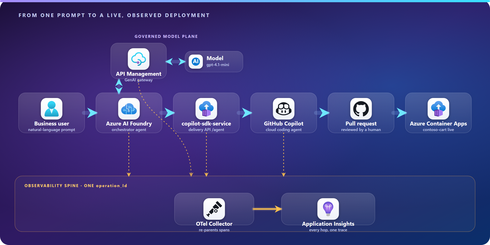
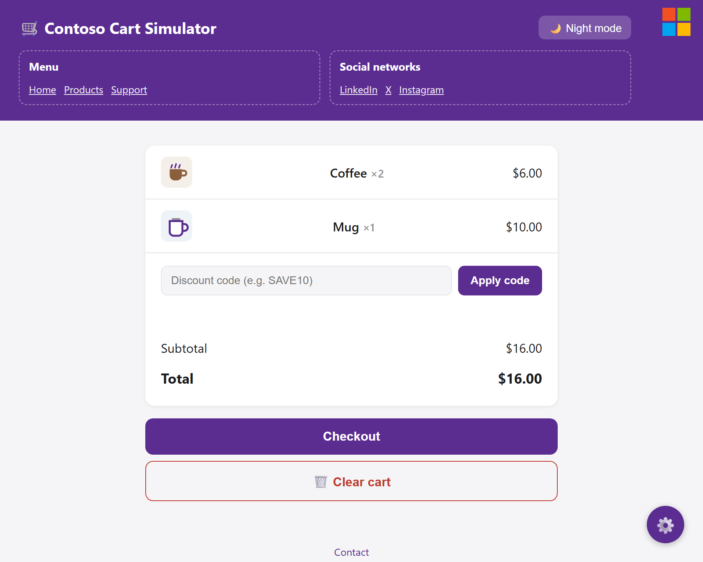
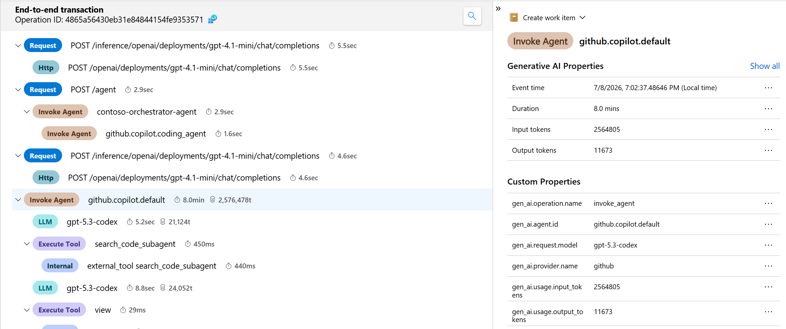
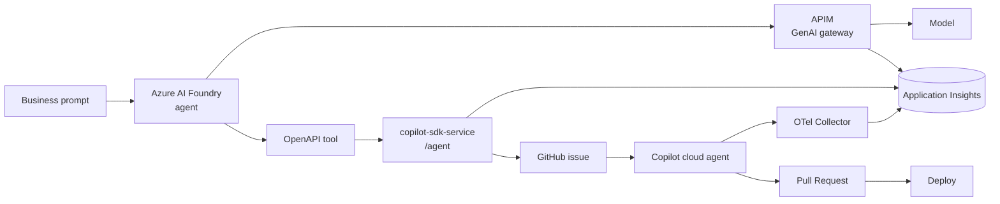

<!-- Social preview: upload docs/assets/social-preview.svg (exported to PNG) under
     Settings -> General -> Social preview for a branded LinkedIn/Twitter card. -->

<div align="center">



<h1>Agentic SDLC on Azure</h1>

<p><strong>A natural-language request becomes a reviewed pull request and a live deployment — governed, and fully observable end to end.</strong></p>

<p>
  <a href="https://github.com/eduxfernandes05/contoso-cart/actions/workflows/deploy.yml">
    
  </a>
  
  
  
  
  
</p>

<p>
  <a href="#-demo"><b>Demo</b></a> ·
  <a href="#-how-it-works"><b>How it works</b></a> ·
  <a href="#-quickstart"><b>Quickstart</b></a> ·
  <a href="#-observability-proof"><b>Observability</b></a> ·
  <a href="docs/architecture.md"><b>Architecture</b></a>
</p>

</div>

---

## Why this matters

Most "AI writes code" demos stop at a suggestion in the editor. This one closes the loop: a business person types what they want in plain language, and a **governed, autonomous pipeline** turns it into a merged pull request and a running change on the internet — with **every hop captured in a single distributed trace** you can audit.

A hosted **Azure AI Foundry** agent reasons through an **APIM-governed** model, delegates the implementation to the **GitHub Copilot cloud agent**, and the change ships to **Azure Container Apps**. Intent and implementation stay separate; humans stay in the loop at the pull request; nothing about the model traffic is ungoverned or invisible.

---

## Demo

> The live storefront being changed here is **`contoso-cart`** — a tiny shopping-cart app. Ask for a feature, watch it land, and follow the whole thing in one Application Insights trace.

<div align="center">

<!-- Real Application Insights end-to-end transaction (sped up ~1.6x). Full video: docs/assets/demo.mp4 -->


<em>One delegated run in Application Insights — APIM, the delivery API and the GitHub Copilot cloud-agent tree under a single <code>operation_Id</code>. ▶ <a href="docs/assets/demo.mp4">Watch the full video</a>.</em>

</div>

|  |  |
|---|---|
|  |  |
| The **contoso-cart** storefront that redeploys on every merge. | The end-to-end transaction: one **operation_Id** across APIM, `/agent`, and the cloud-agent spans. |

---

## How it works



The Foundry agent owns the **intent** (*what* to build and why); the GitHub Copilot cloud agent owns the **implementation** (*which* files and functions change). Full system design, runtime sequence and span reference live in [docs/architecture.md](docs/architecture.md).

---

## What this demo shows

- **Governed model access** — the agent reaches the model only through Azure API Management.
- **Intent vs implementation** — Foundry decides *what* to build; GitHub Copilot decides *how*.
- **Human in the loop** — work lands as an issue and a pull request before merge.
- **End-to-end observability** — one `operation_Id` contains APIM, the delivery API, and the deep cloud-agent execution tree (LLM calls, tool calls, permissions).
- **Live proof** — merging deploys the `contoso-cart` site to Azure Container Apps.

---

## Quickstart

Run the demo storefront locally:

```bash
npm install
npm test
npm start
```

The site runs on `http://localhost:3000`.

---

## Deploy

The `contoso-cart` site deploys to Azure Container Apps on every push to `main` via [.github/workflows/deploy.yml](.github/workflows/deploy.yml) using OIDC. The full stack (delivery API, OpenTelemetry Collector, Foundry tool, APIM and the site) is described in [docs/deployment.md](docs/deployment.md).

---

## Observability proof

After a delegation, open Application Insights and search **Transaction search** for your run's `operation_Id`.

The transaction spans APIM, `POST /agent`, `contoso.orchestrator`, `copilot.cloud_agent.task`, and the GitHub Copilot cloud-agent tree (`invoke_agent`, `chat`, `execute_tool`, `permission`). Details and KQL in [docs/observability.md](docs/observability.md).

---

## Repository structure

```text
.
├── server.js, src/, public/, test/     # contoso-cart demo app
├── docs/assets/                        # hero, social preview, screenshots
├── .github/workflows/deploy.yml        # CI/CD to Azure Container Apps
├── copilot-sdk-service/                # delivery API (/agent), Bicep infra, Foundry OpenAPI tool
├── observability/otel-collector/       # OpenTelemetry Collector config
└── docs/                               # architecture, deployment, observability
```

---

## Documentation

| Document | Contents |
|---|---|
| [docs/architecture.md](docs/architecture.md) | System design, runtime sequence, trace correlation, span reference |
| [docs/deployment.md](docs/deployment.md) | Azure + GitHub resources and how to deploy and configure each part |
| [docs/observability.md](docs/observability.md) | Validated trace, telemetry paths, KQL queries |
| [docs/copilot-usage-records.md](docs/copilot-usage-records.md) | Optional enterprise audit layer via GitHub Copilot Usage Records |

---

## Stack

Azure AI Foundry · Azure API Management · Azure Container Apps · GitHub Copilot cloud agent · OpenTelemetry · Application Insights

---

## License

Released under the [MIT License](LICENSE).
