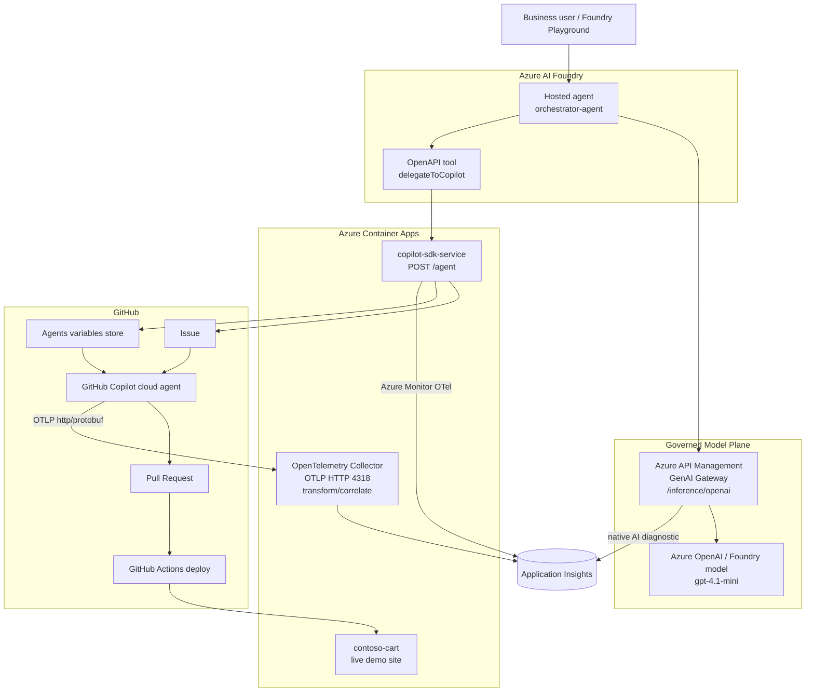
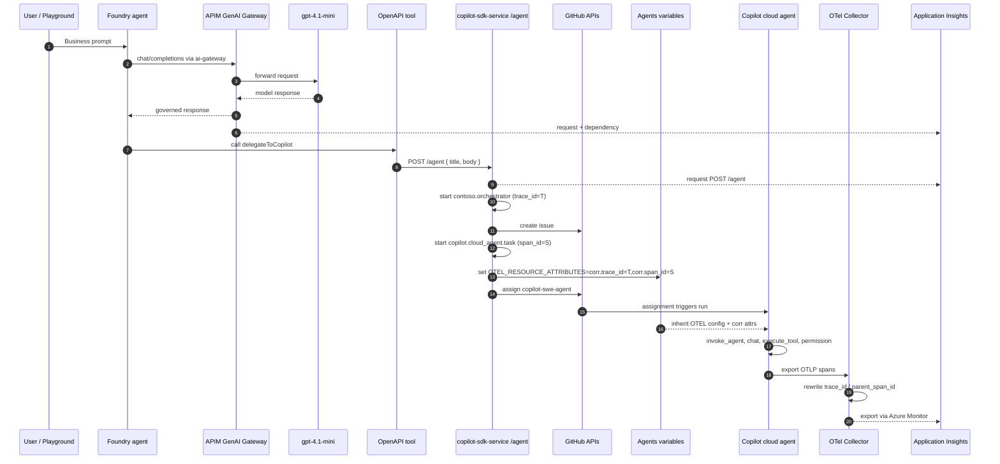
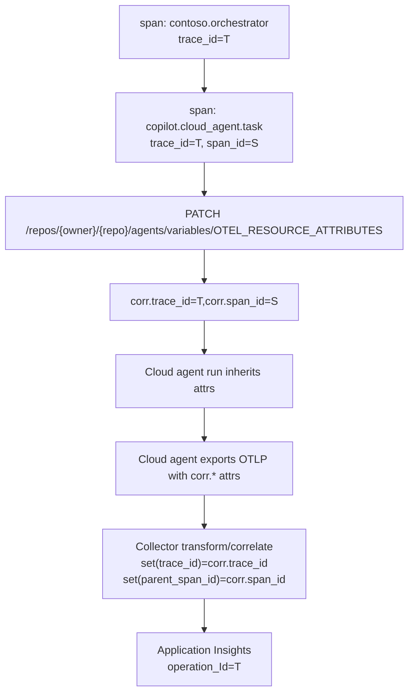

# Architecture

This demo connects Azure AI Foundry, Azure API Management, Azure Container Apps, GitHub Copilot and Application Insights into a single governed, observable software-delivery loop.

A business request in natural language becomes a reviewed pull request and a deployed change, with the whole chain visible in one distributed trace.

---

## System Overview



Two responsibilities are kept separate on purpose:

- The Foundry agent owns the **intent**: what should change and why.
- The GitHub Copilot cloud agent owns the **implementation**: which files and functions to change.

---

## Runtime Sequence



---

## Trace Correlation

The GitHub-hosted cloud agent does not join the API trace through native `TRACEPARENT`. Correlation is carried as resource attributes and applied in the collector.



API side (`copilot-sdk-service/src/api/routes/agent.ts`):

```ts
const { traceId, spanId } = taskSpan.spanContext();
await upsertAgentsVariable(
  token,
  owner,
  name,
  "OTEL_RESOURCE_ATTRIBUTES",
  `corr.trace_id=${traceId},corr.span_id=${spanId}`,
);
```

Collector side (`observability/otel-collector/config.yaml`):

```yaml
processors:
  transform/correlate:
    error_mode: ignore
    trace_statements:
      - context: span
        statements:
          - set(trace_id.string, resource.attributes["corr.trace_id"]) where resource.attributes["corr.trace_id"] != nil
          - set(parent_span_id.string, resource.attributes["corr.span_id"]) where resource.attributes["corr.span_id"] != nil and parent_span_id.string == ""
```

`OTEL_RESOURCE_ATTRIBUTES` is a repo-level variable. This is safe for sequential runs; concurrent delegations need a per-run isolation strategy.

---

## Component Responsibilities

| Component | Role |
|---|---|
| Foundry hosted agent | Reasons about the request and decides what to delegate |
| APIM GenAI Gateway | Single governed entry point for model traffic (policy, quota, logging) |
| OpenAPI tool `delegateToCopilot` | Bridges the agent to the delivery API |
| `copilot-sdk-service` `/agent` | Creates a GitHub issue, assigns Copilot, emits trace spans |
| GitHub Copilot cloud agent | Reads the repo, edits code, opens a pull request |
| OpenTelemetry Collector | Receives cloud-agent OTLP, re-parents spans, exports to Application Insights |
| GitHub Actions | Deploys the app to Azure Container Apps after merge |

---

## What Each Span Represents

| Span / request | Source | Table | Meaning |
|---|---|---|---|
| `POST /inference/openai/.../chat/completions` | APIM | requests | Foundry called the model through APIM |
| `POST /openai/.../chat/completions` | APIM | dependencies | APIM forwarded to the model endpoint |
| `POST /agent` | Container App API | requests | The OpenAPI tool called the delivery API |
| `contoso.orchestrator` | `copilot-sdk-service` | dependencies | Logical orchestration span |
| `copilot.cloud_agent.task` | `copilot-sdk-service` | dependencies | The moment work is delegated to the cloud agent |
| `invoke_agent` | Copilot cloud agent | dependencies | Main cloud-agent execution |
| `chat <model>` | Copilot cloud agent | dependencies | Internal LLM calls with token attributes |
| `execute_tool view/edit/bash` | Copilot cloud agent | dependencies | Tools used against the repo |
| `permission` | Copilot cloud agent | dependencies | Authorization gates for tool calls |

For the observability proof, KQL queries and telemetry paths, see [observability.md](observability.md).
