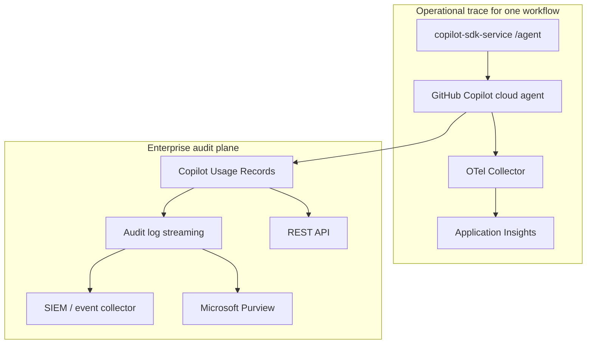

# Copilot Usage Records (Enterprise Audit)

This is an optional enterprise-audit layer that complements the App Insights trace.

Application Insights proves one workflow end to end. GitHub Copilot Usage Records provide enterprise-wide session evidence across Copilot clients. It is a **GitHub Enterprise Cloud** capability, not a per-repository setting.

---

## What It Adds

| Question | Best source |
|---|---|
| Did this specific run pass through APIM, `/agent`, `copilot.cloud_agent.task` and tool calls? | Application Insights + OpenTelemetry |
| Which Copilot sessions happened across the enterprise, on which client, with which prompts/responses/tool calls? | Copilot Usage Records |
| How do I feed this into SIEM/Purview without instrumenting each app? | Audit log streaming + Copilot Usage Records |

Use App Insights for operational traceability and Usage Records for enterprise auditability.

---

## Availability

Usage Records are available to GitHub Enterprise Cloud customers with Enterprise Managed Users (and to GitHub Enterprise Cloud with data residency where applicable). It covers agent session data across:

- Cloud agents on github.com and data-resident deployments on ghe.com
- GitHub Copilot CLI
- Visual Studio Code
- Visual Studio
- Partner IDEs such as JetBrains and Eclipse

This capability is public preview. Treat it as enterprise-controlled, not as an app dependency.

---

## Where It Fits



---

## Enablement

1. Open enterprise settings in GitHub and go to AI Controls.
2. Under Copilot, set `Copilot Usage Records Streaming` to `Enable everywhere`.
3. Under Copilot, set `Copilot Usage Records API` to `Enable everywhere`.
4. Configure an audit log streaming destination (Azure Event Hubs, Azure Blob Storage, Microsoft Purview for Copilot agent session events, Splunk, Amazon S3, Datadog, or Google Cloud Storage).

REST endpoint for on-demand pulls (recent records):

```http
GET /enterprises/{enterprise}/copilot/usage-records
```

```powershell
gh api "/enterprises/<enterprise>/copilot/usage-records"
```

---

## Suggested Azure Destination

For a Microsoft-aligned setup, stream into Azure and keep the App Insights trace in parallel:

```text
GitHub Copilot Usage Records Streaming
  -> Azure Event Hubs
  -> normalizer (Azure Function)
  -> Log Analytics / Microsoft Sentinel
  -> Azure Blob Storage (raw retention)
  -> Microsoft Purview (where available)
```

Operational notes:

- Delivery is at-least-once, so downstream processing should handle duplicates.
- Retention, redaction and access policies belong to the enterprise.
